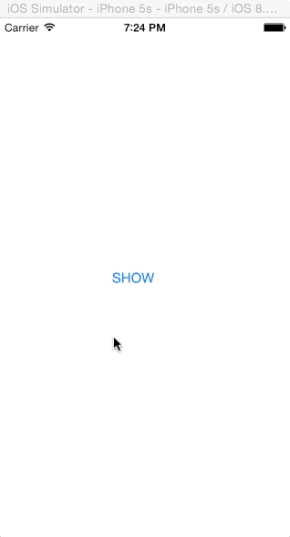

# WZSnakeHUD 

[](https://travis-ci.org/wongzigii/WZSnakeHUD)

## A clean and neat HUD is available NOW.

<p>

</p>

## Installation

Drag the `WZSnakeHUD` file into your project.

## Requirements

 * Xcode 6
 * iOS 8
 * ARC
 
## Usage

1, Add the following import to the top of the file:

```` objc
 #import "WZSnakeHUD.h"
````

2, Use the following to display the HUD:

```` objc
[WZSnakeHUD show:@"Loading"];
````

3, Simply dismiss after complete your task:

```` objc
[WZSnakeHUD hide];
````

## Customize
Feel free to customize.

BackgroundColor:

```` objc
[WZSnakeHUD showWithBackgroundColor:[UIColor purpleColor]];
````

MaskColor:

```` objc
[WZSnakeHUD showWithMaskColor:[UIColor colorWithRed:0.0f green:0.0f blue:0.0f alpha:0.5f]];
````

LineWidth:

```` objc
[WZSnakeHUD showWithLineWidth:4.5f];
````

Dimiss:

```` objc
[WZSnakeHUD hide];
````

## TODO

 * More Customizations and features
 * CocoaPods support

## Author

[Wongzigii](https://github.com/wongzigii)

[wongzigii@outook.com](wongzigii@outlook.com)

## License

[MIT](https://github.com/wongzigii/WZSnakeHUD/blob/master/LICENSE)

Permission is hereby granted, free of charge, to any person obtaining a copy
of this software and associated documentation files (the "Software"), to deal
in the Software without restriction, including without limitation the rights
to use, copy, modify, merge, publish, distribute, sublicense, and/or sell
copies of the Software, and to permit persons to whom the Software is
furnished to do so, subject to the following conditions:

The above copyright notice and this permission notice shall be included in all
copies or substantial portions of the Software.

THE SOFTWARE IS PROVIDED "AS IS", WITHOUT WARRANTY OF ANY KIND, EXPRESS OR
IMPLIED, INCLUDING BUT NOT LIMITED TO THE WARRANTIES OF MERCHANTABILITY,
FITNESS FOR A PARTICULAR PURPOSE AND NONINFRINGEMENT. IN NO EVENT SHALL THE
AUTHORS OR COPYRIGHT HOLDERS BE LIABLE FOR ANY CLAIM, DAMAGES OR OTHER
LIABILITY, WHETHER IN AN ACTION OF CONTRACT, TORT OR OTHERWISE, ARISING FROM,
OUT OF OR IN CONNECTION WITH THE SOFTWARE OR THE USE OR OTHER DEALINGS IN THE
SOFTWARE.
