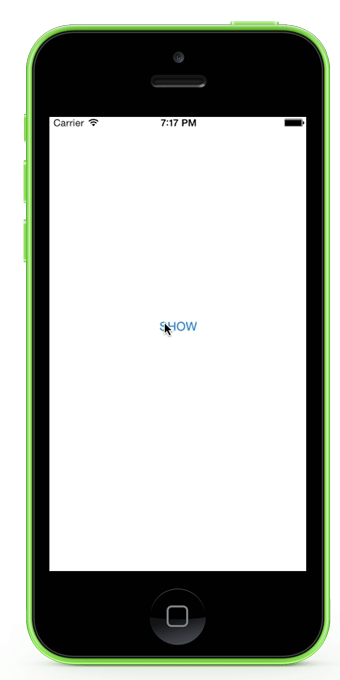

# WZSnakeHUD 

[](https://travis-ci.org/wongzigii/WZSnakeHUD) 
[](http://cocoadocs.org/docsets/WZSnakeHUD)
[](http://cocoadocs.org/docsets/WZSnakeHUD)

<p></p>

## Requirements

 * Xcode 6
 * iOS 8
 * ARC
 
## Installation

WZSnakeHUD is available via [Cocoapods](http://cocoapods.org/), add this line in your podfile :

```` objc
pod 'WZSnakeHUD', '~> 0.1'
````

Run `pod install` to install the dependencies.

## Getting Started

1, Add the following import to the top of the file:

```` objc
 #import "WZSnakeHUD.h"
````

2, Use the following to display the HUD:

```` objc
[WZSnakeHUD show:@"Loading"];
````

3, Simply dismiss after complete your task:

```` objc
[WZSnakeHUD hide];
````

With long-running task, it is recommended to put your stuff on a blackground queue, getting rid of the block of User Interface, and update on the main queue after fired.

```` objc
[WZSnakeHUD show:@"Loading"];
dispatch_async(dispatch_get_global_queue( DISPATCH_QUEUE_PRIORITY_LOW, 0), ^{
	// Do your stuff...
	dispatch_async(dispatch_get_main_queue(), ^{
		[WZSnakeHUD hide];
	});
});
````

## Customize

BackgroundColor:

```` objc
[WZSnakeHUD showWithBackgroundColor:[UIColor purpleColor]];
````

MaskColor:

```` objc
[WZSnakeHUD showWithMaskColor:[UIColor colorWithRed:0.0f green:0.0f blue:0.0f alpha:0.5f]];
````

LineWidth:

```` objc
[WZSnakeHUD showWithLineWidth:4.5f];
````

Dimiss:

```` objc
[WZSnakeHUD hide];
````

## License

WZSnakeHUD is under MIT LICENCE, see the [LICENCE](https://github.com/wongzigii/WZSnakeHUD/blob/master/LICENSE) file for more info.


